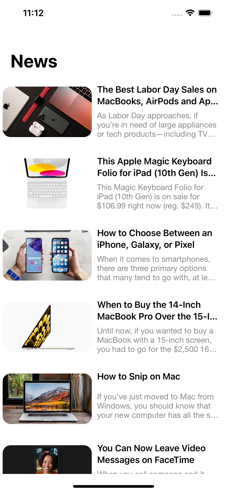
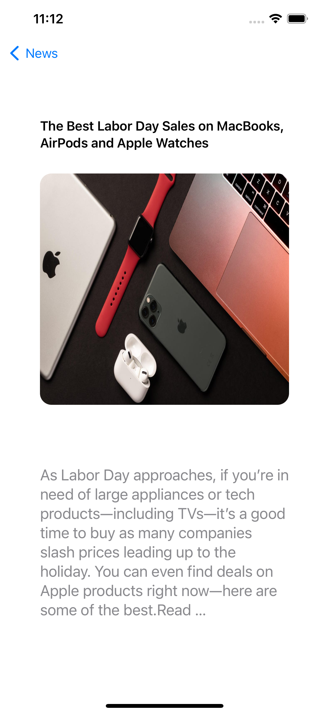
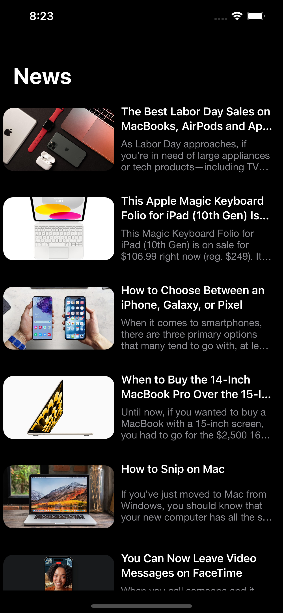
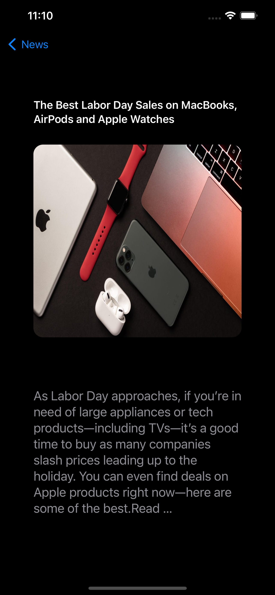

# NewsApp

NewsApp Light Mode  
:-------------------------:
https://github.com/GovindSen0915/NewsApp/assets/85836893/b7c1acd5-f92b-4e3d-a087-b5f57d2657a4

NewsApp Dark Mode
:-------------------------:
https://github.com/GovindSen0915/NewsApp/assets/85836893/f0461fc9-250e-43a3-ab11-a0324870e9dd

Home Screen |  Detail Screen | Home Screen |  Detail Screen
:-------------------------:|:-------------------------:-------------------------:|:-------------------------:
|||

- This project is an iOS app written in Swift using UIKit and ReactiveSwift for handling asynchronous and reactive programming.

- The app's main functionality revolves around displaying news articles in a UITableView.

- It follows the Model-View-ViewModel (MVVM) design pattern, separating the logic into the ViewModel and using protocols to establish communication between components.

- Key components and concepts in the code include:
  - **ViewController**: The main view controller that manages the UITableView and handles user interaction.
  - **ViewModel**: Represents the business logic and data management. It communicates with the API to fetch news articles and prepares cell models.
  - **PaginationUIManager**: Manages pagination and pull-to-refresh functionality in the table view.
  - **CustomPullToRefreshView**: A custom pull-to-refresh view with a Lottie animation.
  - **NewsTableViewCell**: A custom UITableViewCell used to display news article information, including title, description, and an image.

- The app communicates with a news API using an API key for fetching news articles, which are then displayed in the table view.

- It implements a basic loader using Lottie animations to show loading indicators when fetching data.

- The code uses ReactiveSwift for reactive programming, allowing for clean and efficient handling of asynchronous events.

- It supports pagination for loading more news articles as the user scrolls through the table view.

- The code is structured with modularity in mind, separating concerns and adhering to best practices for iOS app development.

- Please note that some parts of the code might rely on external libraries or frameworks, such as Lottie and PaginationUIManager, which should be included in the project's dependencies.

- Ensure to update the API key and other configurations to match your specific use case when deploying the app.
